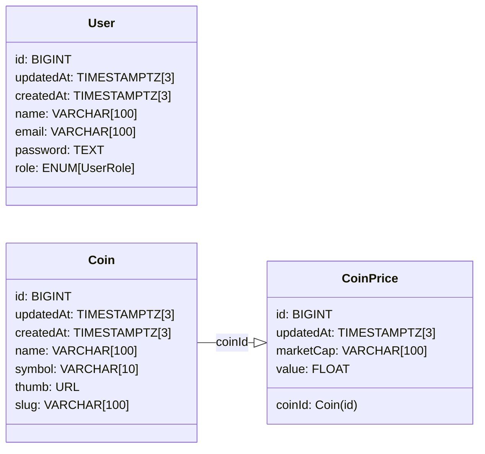

# Truther Coingecko

Project developed as tech challenge for Truther Company

# Dependencies

- [Git](https://git-scm.com/downloads)
- [Node+npm](https://nodejs.org/en)
- [VSCode](https://code.visualstudio.com)
- [Docker](https://www.docker.com/get-started)
- [Pnpm](https://pnpm.io/installation)

> [!IMPORTANT] To to pnpm works correctly on Windows (v10+), you need to enable the Developer Mode.

# Get started

- Clone repository using command:
  
  ```bash
  $ git clone https://github.com/leandroluk/truther-coingecko.git
  ```

- Move to repository path and install dependencies:
  
  ```bash
  $ cd ./truther-coingecko
  $ pnpm install
  ```

# Choices in the development process

- The development pattern applied is focused on creating features where each use case refers to a feature. Any feature that is exposed in the API is declared in the domain layer with input validations and swagger documentation, being reused between projects.

- Any module that can be shared between other future projects is developed in a decoupled manner to optimize development and testing, ensuring minimal butterfly effects on applications in the evolution process.

- The application uses [SOLID](https://en.wikipedia.org/wiki/Solid) features but applied to [YAGNI](https://en.wikipedia.org/wiki/You_aren%27t_gonna_need_it), meaning that inversions or dependency injections will only be applied in cases where they are really necessary.

# Entity Relationship Diagram




# Tips

1. Add command to you shell to move to root of workspace to improve coding process

    <details>

    <summary>On Windows (PowerShell)</summary>

    Use the command `code $PROFILE` to open the shell profile and add this line

    ```pwsh

    function cdroot {
      $current = Get-Location
      while (-not (Test-Path "pnpm-workspace.yaml") -and $current.Path -ne [System.IO.Path]::GetPathRoot($current.Path)) {
        Set-Location ..
        $current = Get-Location
      }
    }
    ```

    Execute the command to refresh terminal `. $PROFILE`

    </details>

    <details>

    <summary>On Linux or Macos</summary>

    Use the command `code ~/.bashrc` to open the shell profile and add this line

    ```bash
    #
    alias cdworkspace='while [ ! -f "pnpm-workspace.yaml" ] && [ "$PWD" != "/" ]; do cd ..; done'
    ```

    Execute the command to refresh terminal `source ~/.bashrc`

    </details>