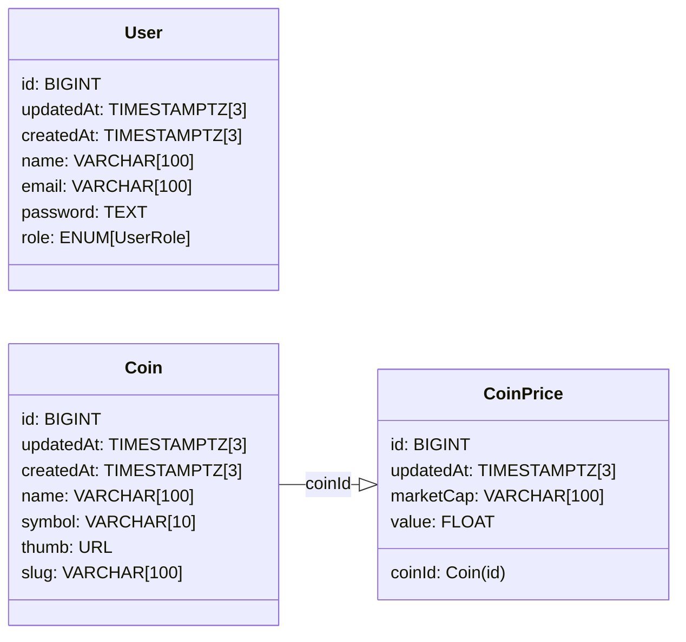

# Truther Coinbase

Project developed as tech challenge for Truther Company

# Dependencies

- [Git](https://git-scm.com/downloads)
- [Node+npm](https://nodejs.org/en)
- [VSCode](https://code.visualstudio.com)
- [Docker](https://www.docker.com/get-started)
- [Pnpm](https://pnpm.io/installation)

> [!IMPORTANT] To to pnpm works correctly on Windows (v10+), you need to enable the Developer Mode.

# Get started

- Clone repository using command:
  
  ```bash
  $ git clone https://github.com/leandroluk/truther-coinbase.git
  ```

- Move to repository path and install dependencies:
  
  ```bash
  $ cd ./truther-coinbase
  $ pnpm install
  ```

# Entity Relationship Diagram

