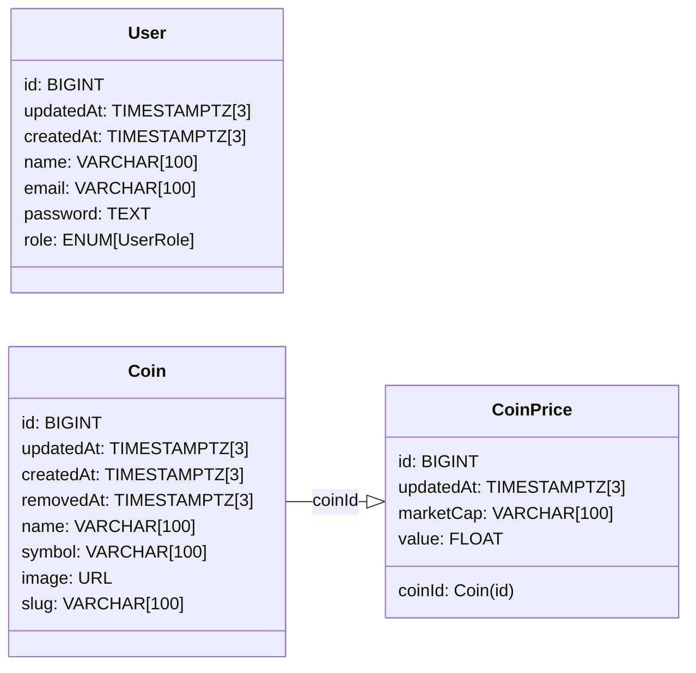

# Truther CoinGecko

Project developed as tech challenge for [Truther Company](https://www.truther.to/) to create an application with authentication and integrate with [CoinGecko API](https://docs.coingecko.com/reference/introduction)

# Dependencies

- [Git](https://git-scm.com/downloads)
- [Node+npm](https://nodejs.org/en)
- [VSCode](https://code.visualstudio.com)
- [Docker](https://www.docker.com/get-started)
- [Pnpm](https://pnpm.io/installation)

> [!IMPORTANT] 
> To to pnpm works correctly on Windows (v10+), you need to enable the Developer Mode.

# Get started

- Clone repository using command:
  
  ```bash
  $ git clone https://github.com/leandroluk/truther-coingecko.git
  ```

- Move to repository path and install dependencies:
  
  ```bash
  $ cd ./truther-coingecko
  $ pnpm install
  ```

# Application structure

- .vscode
  - [extensions.json](./.vscode/extensions.json): recommended extensions to improve the development process.
  - [launch.json](./.vscode/launch.json): launch configurations to run scripts.
  - [settings.json](./.vscode/settings.json): settings used to force eslint works with vscode default formatter.
  - [typescript.code-snippets](./.vscode/typescript.code-snippets): snippets to improve coding experinences.
- apps
  - [api](./apps/api/package.json): backend application made in [nestjs](https://nestjs.com).
- packages               
  - [config-eslint](./packages/config-eslint/package.json): shared rules of eslint 9 for all packages and projects.
  - [config-jest](./packages/config-jest/package.json): shared jest config for all.
  - [config-typescript](./packages/config-typescript/package.json): shared typescirpt config.
  - [domain](./packages/domain/package.json): shared usecases, types, generators, validators, errors, enums and object (aka. entities) using [joi](https://www.npmjs.com/package/joi) and [openid-types](https://www.npmjs.com/package/openapi-types).
  - [nest-auth](./packages/nest-auth/package.json): authentication guards & strategies and service to generate openid tokens using [passport](https://www.npmjs.com/package/passport) and nested packages.
  - [nest-cache](./packages/nest-cache/package.json): agnostic cache module using [redis](https://www.npmjs.com/package/ioredis).
  - [nest-coingecko-api](./packages/nest-coingecko-api/package.json): integration with coingecko api using [axios](https://www.npmjs.com/package/axios).
  - [nest-common](./packages/nest-common/package.json): common functions, classes and stuffs for backend projects
  - [nest-crypto](./packages/nest-crypto/package.json): project created to center any resource related with cryptography in nest projects
  - [nest-database](./packages/nest-database/package.json): persistence package to manage database entities, views and migrations
  - [nest-logger](./packages/nest-logger/package.json): logger module


# Choices in the development process

- The development pattern applied is focused on creating features where each use case refers to a feature. Any feature that is exposed in the API is declared in the domain layer with input validations and swagger documentation, being reused between projects.

- Any module that can be shared between other future projects is developed in a decoupled manner to optimize development and testing, ensuring minimal butterfly effects on applications in the evolution process.

- The application uses [SOLID](https://en.wikipedia.org/wiki/Solid) features but applied to [YAGNI](https://en.wikipedia.org/wiki/You_aren%27t_gonna_need_it), meaning that inversions or dependency injections will only be applied in cases where they are really necessary.

# Entity relationship diagram




# Tips

1. Add command to you shell to move to root of workspace to improve coding process

    <details>

    <summary>On Windows (PowerShell)</summary>

    Use the command `code $PROFILE` to open the shell profile and add this line

    ```pwsh

    function cdroot {
      $current = Get-Location
      while (-not (Test-Path "pnpm-workspace.yaml") -and $current.Path -ne [System.IO.Path]::GetPathRoot($current.Path)) {
        Set-Location ..
        $current = Get-Location
      }
    }
    ```

    Execute the command to refresh terminal `. $PROFILE`

    </details>

    <details>

    <summary>On Linux or Macos</summary>

    Use the command `code ~/.bashrc` to open the shell profile and add this line

    ```bash
    #
    alias cdworkspace='while [ ! -f "pnpm-workspace.yaml" ] && [ "$PWD" != "/" ]; do cd ..; done'
    ```

    Execute the command to refresh terminal `source ~/.bashrc`

    </details>

# Deploying

To build applications use the command

```shell
$ docker build --build-arg PROJECT=apps/${PROJECT_NAME} -t truther-coingecko/${PROJECT_NAME} .
// ex: docker build --build-arg PROJECT=apps/api -t truther-coingecko/api .
```
